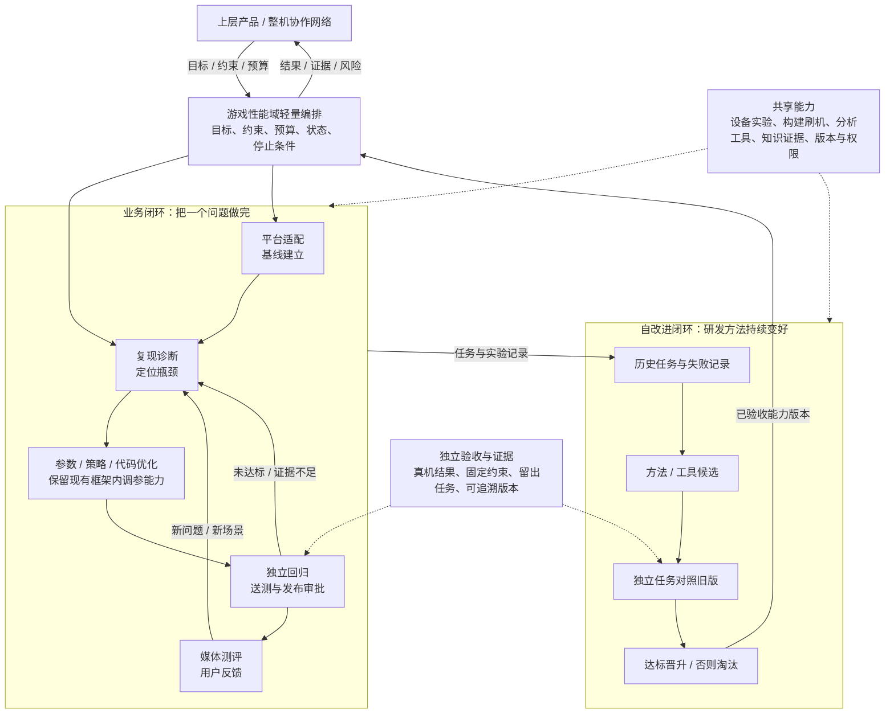

# 游戏性能智能研发体系｜全局蓝图 v0.1

> 状态：架构设计提案，供方向对齐与后续工程映射。不是已实现能力清单，也不构成代码修改、数据外传或发布授权。  
> 依据：你在本次对话中描述的岗位、现有自动调参 Agent，以及全流程协作与自进化设想。尚未审阅源码、实验平台、设备资源或具体授权边界。  
> 配套：6 页可编辑 PPT、同版 PDF、单页总览 PNG。本文是便于团队或编码 Agent 继续维护的文字底稿。

## 1. 定位与目标

建设一个覆盖游戏体验全生命周期、以真实实验为依据、能够受控改进优化方法的智能研发体系。

横向贯通平台适配、游戏性能调优、回归送测、媒体测评与用户反馈；纵向把优化范围从既有参数扩展到策略和获授权的局部产品代码；另设独立的 Agent 方法改进闭环。整个游戏性能域可以作为上层产品与整机协同体系中的一个能力节点。

**核心区分：把调度程序改好，是产品能力改进；把诊断、搜索、工具和研发流程改好，并在独立任务上证明收益，才是 Agent 系统自身的能力改进。**

### 已知起点与待确认事项

| 类别 | 内容 |
| --- | --- |
| 已有能力，依据你的描述 | 一个基于高通调度框架、自动优化参数的 Agent |
| 建议保留 | 现有调参能力，以及工程中已经可靠的构建、采集、搜索和测试工具 |
| 建议新增或补齐 | 统一任务与实验记录、独立评价、按风险路由、代码候选实验、自改进候选验收、向上接口 |
| 尚待确认 | 实际可编辑模块、构建刷机与恢复链路、实验设备规模、评测体系、源码与日志的允许使用环境、责任人与权限 |

不把 ASI、Agent 数量、自动运行时长或代码变更量设为首版验收目标；不把重构现有工程、搭建大型平台或训练基础模型作为前置条件。

## 2. 一页全局结构

箭头表达任务与证据关系，不要求所有任务依次执行所有步骤。具体运行时，应依据任务类型、已有证据、风险与预算选择短路径。

## 3. 各层职责与产物

| 层级或能力 | 应负责的事 | 主要产物或接口 |
| --- | --- | --- |
| 上层产品 / 整机协同 | 提出体验目标、硬约束、资源预算与交付要求；裁决跨域取舍 | 输入目标与约束，接收结果、证据和风险 |
| 游戏性能域编排 | 管理任务状态、依赖、路由、实验预算、重试、审批、停止和恢复 | 唯一任务记录与可追溯状态 |
| 平台适配与基线 | 明确可观察、可调、可编辑与可测试的范围 | 能力清单、版本清单、基线与限制 |
| 复现与诊断 | 将模糊体验问题变成可验证假设；证据不足时补采集 | 复现条件、证据引用、假设与实验计划 |
| 参数 / 策略 / 代码优化 | 选择最小可验证改动，不默认每个问题都需要改代码 | 参数候选、策略候选或隔离分支补丁 |
| 独立回归与送测 | 判定收益、回归与适用范围；通过批准的链路提交交付物 | 测试报告、候选版本、风险与回滚方案 |
| 媒体测评与用户反馈 | 将外部问题转化为可复现任务；保留无法验证的状态 | 带设备、版本、场景与证据的任务入口 |
| Agent 自改进 | 从任务证据提出研发方法改进，经过独立任务验证后升级 | 有适用范围和版本的诊断、搜索、工具或流程能力 |
| 共享能力 | 提供可靠工具、资源互斥、证据记录与权限执行 | 工具接口、设备队列、证据目录、版本与审计记录 |

媒体或用户反馈不是自动改写底层代码的直接指令，也不是无需核验的奖励信号。初期可以通过人工整理的结构化任务接入，不必先建设全面自动采集平台。

## 4. Agent 与工具的拆分原则

需要理解上下文、提出假设、判断不确定性或选择下一步的任务，可由 Agent 承担。执行步骤确定的动作，如构建、刷机、采集、计算指标和固定格式报告，优先由可靠工具执行。

只有当子问题确实需要独立上下文、专用工具、独立验收或并行处理时，再拆分子 Agent。CPU、GPU、内存、温控和显示分析可以先作为按需调用的能力，不必一开始全部做成常驻 Agent。

一个任务应有一个明确的结果负责人；每个子任务有预算、最大拆分范围、超时和停止条件。任务状态以工具与任务记录为准，而不是以聊天里“已完成”的表述为准。

## 5. 两条闭环及其验收

### A. 产品优化闭环

问题与机制假设 → 生成参数、策略或代码候选 → 真机对照与回归 → 接受或淘汰产品版本。

验收对象是产品体验。建议由专业责任人明确帧时间与卡顿、持续性能、功耗、温升、输入响应、画质和稳定性的组合指标，先确定不能突破的硬约束，再比较候选收益。

候选需要相对固定基线进行重复对照，保留失败记录、软件与测试工具版本以及环境条件。历史 Trace、仿真和离线检查可以辅助筛选候选，但不替代修改后真实设备上的闭环验证。

多次调参无收益，只说明已探索范围内未找到改进，不能据此宣称整个框架已经到达上限。代码探索需要机制假设、授权范围和可恢复的实验条件。

### B. Agent 自改进闭环

历史任务与失败记录 → 提出诊断、搜索、工具或流程改进 → 生成候选能力版本 → 在独立任务上对照旧版 → 达标晋升，否则淘汰。

验收对象是研发能力。建议采用：在相同或明确可比较的模型与资源预算下，新版能否在未参与本轮优化的任务上，更稳定地达标，或者用更少真机实验和人工介入取得同等结果。

独立记录产品版本、Agent 能力版本、底座模型版本和评测版本。不能把更换底座模型带来的收益直接算作 Agent 自进化，也不能把写出总结或更长提示词当成已验证的能力提升。

候选生成者可以提出新测试，但不能自行替换当前验收口径、降低阈值或删除失败记录。独立任务集的反复查询应受控，避免它逐渐变成另一套探索集。

### 两条闭环如何相连

业务闭环持续提供任务与实验记录；方法闭环从中产生候选能力。只有经过独立验收的方法与工具，才进入后续业务任务。原始证据、成功条件、失败情况和适用边界都应随经验一起保留。

## 6. 最小任务与实验契约

首版不必实现统一大平台，但应尽早统一以下信息。

| 记录对象 | 最少需要说明的内容 |
| --- | --- |
| 任务 | 唯一标识、问题描述、设备和游戏范围、软件基线、目标与硬约束、责任人、预算、停止条件、允许动作、验收版本 |
| 实验 | 任务标识、假设、候选版本、基线版本、设备状态、场景、环境条件、执行状态、原始证据位置、结果与异常 |
| 候选产物 | 参数或补丁、构建标识、适用范围、依赖、测试报告、风险、恢复和回滚方式 |
| 能力版本 | 改进对象、旧版与候选、底座模型和工具版本、独立任务集标识、比较预算、结果与接受决定 |

面向上层的输入保持简单：设备、游戏、软件版本，目标、硬约束和资源预算。输出包括达成情况、独立证据、候选版本、风险和回滚方案。

同一设备的刷机、配置修改和性能实验需要互斥与状态恢复；并行代码候选使用隔离分支或工作区。共享工具有负责人、版本与兼容性约定，而不是所有 Agent 共享全部会话和全部权限。

首版可采用任务文件、现有测试脚本和版本化实验目录；是否需要数据库、消息队列、知识图谱或新的 Agent 框架，应根据真实规模再决定。

## 7. 权限、评测与部署边界

| 动作范围 | 建议首版自主权 | 接受边界 |
| --- | --- | --- |
| 白名单参数与配置 | 在批准的实验设备和预算内自动搜索、执行、比较、淘汰 | 不能绕过温控、稳定性等硬约束；正式发布仍需授权 |
| 获授权局部策略或产品代码 | 自动提出补丁、构建并执行批准的测试 | 独立回归与责任人评审后接受 |
| Agent 的方法与工具 | 离线产生候选版本并与旧版对照 | 独立任务达标后晋升，保留完整版本与证据 |
| 验收口径、安全保护、权限和发布规则 | 不允许候选自行放宽、删除或扩大 | 独立变更、审批和版本化；必要时重测基线 |

权限需要由工具、平台和运行环境执行，不能仅依赖提示词。源码、日志和设备数据只进入公司批准的模型与执行环境。具体高通相关模块是否可修改，必须以真实工程、可用构建链和授权为准。

研发阶段运行复杂 Agent 进行探索；端侧只部署经过验证的参数、代码或轻量策略。不将云端大模型直接放进逐帧调度路径，也不让消费者设备持续试验性改写系统。

独立工具结果是验收依据。另一个 Agent 的口头批准可以辅助审查，但不能替代真实实验与必要的人类责任决策。

## 8. 建设路线与过关证据

### G0：从现有调参 Agent 建立可信小闭环

保留现有实现，选一个有价值且可复现的任务，接通任务记录、基线、实验、独立判断、结果归档和恢复。交付一份从问题到结论的完整证据包。

**过关证据：** 同一任务可复现；能明确说明改好、失败，或者证据不足。不是必须得到正向收益才算流程可用。

### G1-A：受控代码探索

选一个边界清楚、获授权且可恢复的局部模块，自动生成最小补丁、构建、运行真机对照和回归。

**过关证据：** 相对产品基线的收益及副作用都有证据，结论可复现；生成补丁本身不是成绩。

### G1-B：Agent 方法改进

选一种实际低效环节，如瓶颈诊断、实验排序、搜索空间选择或日志分析，形成一个候选能力版本，与旧版在独立任务上对照。

**过关证据：** 同等或可比较预算下，新版在独立任务上更好，或以更少实验完成同等目标。

G1-A 与 G1-B 可并行、分别验收。修改产品代码不是 Agent 自改进的必经前置步骤。

### G2：横向扩展与向上集成

逐步接入平台适配、送测、媒体与用户反馈。通过相同任务、证据和版本规范调用可靠核心。向上提供团队级输入输出接口，向其他节点提供可复用的实验和分析能力。

**过关证据：** 新入口进入同一闭环；第二个业务节点确实复用一项公共能力，而不是复制一套工具与提示词。

这是一条按能力验收的路线，不是工期承诺。人员、设备、源码范围和现有工具情况明确后，才能细化排期。

## 9. 三类成效指标

| 维度 | 建议观察的指标 | 不应替代它的数字 |
| --- | --- | --- |
| 产品价值 | 既定约束下的体验收益、回归与稳定性 | 只看平均帧率、只看某次最好结果 |
| 研发效率 | 达到有效结论的真机实验成本、人工介入与周期 | 自动运行时长、调用次数、生成代码量 |
| 方法进化 | 独立任务达标率、相同预算下的结果、能力适用范围 | Agent 数量、提示词长度、总结数量 |

初期不填未经测量的提升百分比。先记录基线与资源预算，再确定目标。

## 10. 首轮架构评审需要确认的事项

优先确认一个代表性任务及产品硬约束；指定任务结果与独立验收责任人；列出当前可调用的构建、刷机、采集和分析工具；划定可修改代码及允许使用的数据环境；明确真机与计算预算、停止和恢复条件。

下一份工程材料应是“现状映射与缺口表”：把现有调参 Agent、测试脚本、构建链路和日志工具映射到本蓝图，判断哪些保留、哪些用薄适配接入、哪些确有必要新增。未经该映射和授权，不直接按蓝图启动大规模重构。

## 对上沟通的一段话

> 我计划把现有自动调参 Agent 升级为游戏性能智能研发体系。横向贯通适配、调优、送测和反馈；纵向从参数扩展到策略及获授权的局部代码；同时单独验证 Agent 在诊断、搜索和工具上的能力改进。全局边界先定义，但实施从一个可信小闭环起步。以体验收益、有效实验成本和独立任务能力提升验收，而不是以 Agent 数量或生成代码量验收。
